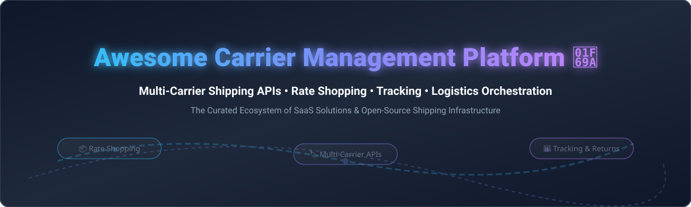

# 🚚 Awesome Carrier Management Platform

   

  

## 📌 Top Carrier Management Platforms Ecosystem & Logistics Orchestration

> A curated list of top commercial SaaS carrier management platforms, shipping APIs, and open-source multi-carrier logistics software for rate shopping, label generation, package tracking, address validation, and returns automation.

**Last updated: September 2026** 📅

---

## 📖 Table of Contents
- [📊 Market Overview & Industry Structure](#-market-overview--industry-structure)
- [🏢 SaaS & Commercial Platforms](#-saas--commercial-platforms)
- [💻 Open-Source GitHub Projects](#-open-source-github-projects)
- [🤝 How to Contribute](#-how-to-contribute)
- [💖 Support & Community](#-support--community)
- [📈 Star History](#-star-history)
- [⚠️ Disclaimer](#-disclaimer)

---

## 📊 Market Overview & Industry Structure

> 💡 **Market Size & Structure**: The global multi-carrier parcel management and logistics orchestration software market is estimated at **$3.8 Billion to $5.2 Billion**, expanding at a CAGR of **~11-13%**. The sector is **moderately fragmented**: enterprise delivery management is led by consolidated logistics technology giants (e.g. Descartes, Metapack/Stamps.com/Auctane), while mid-market and API-first shipping services feature dynamic competition among specialized platforms like EasyPost, Shippo, and Sendcloud.

---

## 🏢 SaaS & Commercial Platforms

Top enterprise and mid-market SaaS platforms offering multi-carrier shipping APIs, negotiated rate shopping, automated fulfillment, and delivery experience management. Sorted by company scale (revenue / valuation descending).

| 🏢 Platform | 💰 Starting Price | 🎁 Free Tier / Trial Limit | 📐 Company Scale (Revenue / Valuation) | 📝 Description |
| :--- | :--- | :--- | :--- | :--- |
| **[Descartes](https://www.descartes.com/)** | $250 / month | 14-day enterprise demo (No permanent free tier) | **~$580M Revenue / $8.5B Market Cap** | Enterprise global logistics and multi-carrier shipping transportation suite. |
| **[ShipStation](https://www.shipstation.com/)** | $9.99 / month | 30-day free trial (up to 50 shipments during trial) | **~$500M+ Parent (Auctane) Revenue** | Popular multi-carrier order fulfillment and shipping label platform for SMBs & ecommerce. |
| **[ShipEngine](https://www.shipengine.com/)** | $0 monthly fee ($0.05/label) | $10 free shipping credit on signup (no monthly subscription fee) | **~$500M+ Parent (Auctane) Revenue** | Developer-focused multi-carrier shipping API for rates, labels, tracking, and address validation. |
| **[EasyPost](https://www.easypost.com/)** | $0 monthly fee ($0.05/label after free tier) | 120 free shipping labels / month (Forever free Developer Tier) | **~$100M+ Revenue / $600M+ Valuation** | Leading shipping API offering rate shopping, parcel tracking, and address verification. |
| **[Metapack](https://www.metapack.com/)** | $400 / month | 14-day enterprise sales sandbox trial | **~$90M+ Revenue** | Enterprise delivery experience and multi-carrier shipping orchestration platform. |
| **[Shippo](https://goshippo.com/)** | $0 monthly fee (Carrier rate costs apply) | 30 free label downloads / month (Starter Plan) | **~$50M+ Revenue / $1B Valuation** | Multi-carrier shipping API for labels, rates, automated tracking, and order fulfillment. |
| **[Sendcloud](https://www.sendcloud.com/)** | €23 / month | 14-day free trial (up to 50 shipments) | **~$45M+ Revenue / $750M+ Valuation** | All-in-one European multi-carrier shipping platform for labels, tracking, and returns. |
| **[ShippyPro](https://www.shippypro.com/)** | €29 / month | 30 free orders trial (14 days validity) | **~$15M+ Revenue** | European multi-carrier shipping management platform connecting 160+ carriers. |
| **[Sorted](https://www.sorted.com/)** | £150 / month | 14-day platform trial | **~$12M+ Revenue** | Delivery experience and multi-carrier shipping tracking & post-purchase platform. |
| **[FreightPOP](https://www.freightpop.com/)** | $150 / month | 14-day software trial | **~$10M+ Revenue** | Multi-carrier parcel & freight shipping platform with rate shopping and TMS features. |

---

## 💻 Open-Source GitHub Projects

Self-hostable shipping APIs, carrier SDKs, and open-source logistics platforms for rate calculation, label printing, and package tracking without recurring SaaS fees. Sorted by GitHub Stars_Count descending.

-  **[Fleetbase](https://github.com/fleetbase/fleetbase)** — Open-source modular logistics, dispatch, and supply chain API infrastructure for fleet management and shipping workflows.
-  **[Karrio](https://github.com/karrioapi/karrio)** — Leading open-source multi-carrier shipping API engine (formerly Purplship). Self-hostable platform for rates, label printing, tracking, and carrier integration.
-  **[OpenBoxes](https://github.com/openboxes/openboxes)** — Open-source inventory management and supply chain fulfillment system supporting order dispatch and parcel tracking.
-  **[Magento Carrier Preselect](https://github.com/quafzi/magento-carrier-preselect)** — Open-source Magento extension for automated ecommerce carrier selection and shipping rate routing.
-  **[Shippy](https://github.com/verbb/shippy)** — Framework-agnostic multi-carrier shipping library for PHP offering unified rate shopping and label abstractions.
-  **[Purplship](https://github.com/EzeeSpace/purplship)** — Multi-carrier shipping SDK and integration platform (historical core foundation of Karrio).

---

## 🤝 How to Contribute

Contributions are welcome! Please follow these steps to add or update carrier management tools:

1. 🍴 Fork the repository.
2. 📝 Add/edit entries in `README.md` following the table or list format.
3. 🔍 Provide accurate data regarding pricing, free limits, or open-source Stars_Badges.
4. 🚀 Submit a Pull Request with a short summary of changes.

---

## 💖 Support & Community

If you find this repository helpful for your ecommerce, logistics, or developer workflow:

- 🌟 **Star this repository** to show your support!
- 🔀 **Fork it** to customize it for your team's internal shipping stack.
- 📢 **Share it** with fellow logistics engineers and ecommerce builders.
- ☕ **Buy me a coffee**: Support ongoing open-source maintenance via [GitHub Sponsors](https://github.com/sponsors/ishandutta2007).

---

## 📈 Star History

---

## ⚠️ Disclaimer

- This list is **community-curated** for informational and educational purposes.
- Product pricing, free tier terms, and valuations change over time; please verify details directly with official platform providers.
